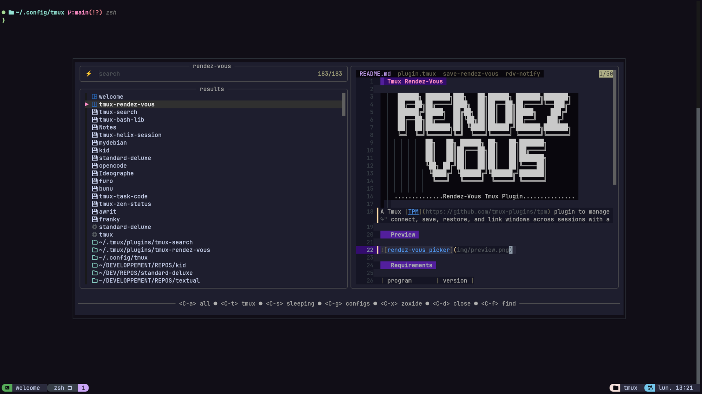
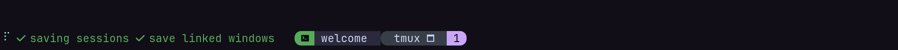
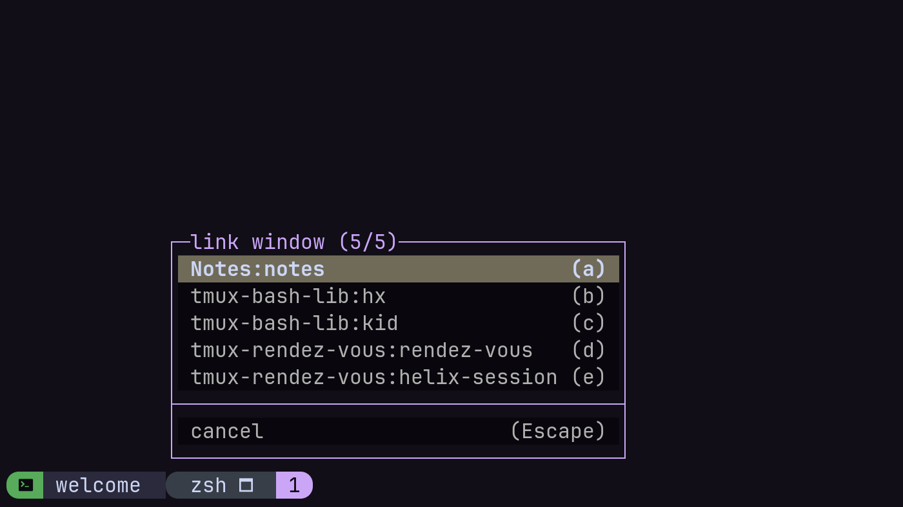

# Tmux Rendez-Vous

     ██████╗ ███████╗███╗   ██╗██████╗ ███████╗███████╗
     ██╔══██╗██╔════╝████╗  ██║██╔══██╗██╔════╝╚══███╔╝
     ██████╔╝█████╗  ██╔██╗ ██║██║  ██║█████╗    ███╔╝
     ██╔══██╗██╔══╝  ██║╚██╗██║██║  ██║██╔══╝   ███╔╝
     ██║  ██║███████╗██║ ╚████║██████╔╝███████╗███████╗
     ╚═╝  ╚═╝╚══════╝╚═╝  ╚═══╝╚═════╝ ╚══════╝╚══════╝
             ██╗   ██╗ ██████╗ ██╗   ██╗███████╗
             ██║   ██║██╔═══██╗██║   ██║██╔════╝
             ██║   ██║██║   ██║██║   ██║███████╗
             ╚██╗ ██╔╝██║   ██║██║   ██║╚════██║
              ╚████╔╝ ╚██████╔╝╚██████╔╝███████║
               ╚═══╝   ╚═════╝  ╚═════╝ ╚══════╝

    ..............Rendez-Vous Tmux Plugin...............

A Tmux [TPM](https://github.com/tmux-plugins/tpm) plugin to manage tmux sessions — pick, connect, save, restore, and link windows across sessions with a unified interface.

## Preview



## Requirements

| program       | version |
| :------------ | :--------------------------------------- |
| tmux          | 3.6+ is required                         |
| bash          | 4.4+ is required                         |
| tmux-bash-lib | tmux plugin with development helpers     |
| sesh          | for managing sessions                    |
| lazy-tmux     | for sessions persistence / restoration   |
| fzf           | for plugin pickers                       |
| zoxide        | required by *sesh*                       |

## Installation

After installing dependencies, you can add this plugin through [TPM](https://github.com/tmux-plugins/tpm):

1. Install [TPM](https://github.com/tmux-plugins/tpm)
2. Add these lines to your `tmux.conf`:

```bash
set -g @plugin 'gravures/tmux-bash-lib'
run-shell ~/.tmux/plugins/tmux-bash-lib/plugin.tmux # plugin bootstrap required

set -g @plugin 'gravures/tmux-rendez-vous'
```

3. Run `<prefix>+I` for TPM to install the plugin.

## Overview

tmux-rendez-vous brings together two powerful tools into a single tmux workflow:

- **[sesh](https://github.com/joshmedeski/sesh)** handles the smart parts of session management — it auto-names sessions from git repos or directories, integrates with zoxide for fast project jumping, and supports session configuration via `sesh.toml`.
- **[lazy-tmux](https://github.com/alchemmist/lazy-tmux)** handles persistence — it snapshots your sessions (including running processes and scrollback) and restores them on demand, so you only pay the cost of the sessions you actually use.

Rendez-vous wraps both behind a unified **picker** and adds a few extras: a **window-linker** for sharing windows across sessions, a **save daemon**, and a lightweight **notification system** for background tasks.

Once installed, the plugin injects its `bin/` directory into your tmux environment's `PATH` and registers a set of command aliases. The main entry point is the **rendez-vous picker**.

## Usage

### Rendez-Vous Picker

The core component, a single *tmux popup* that lets you browse and connect to all your sessions in one place.

The picker aggregates four sources into a unified list:

- **tmux sessions** — currently running sessions
- **sleeping sessions** — saved sessions waiting to be restored
- **config sessions** — defined in your `sesh.toml`
- **zoxide directories** — your most-used project directories

Select any item and press Enter to connect. A live preview (via `sesh preview`) shows the session's directory contents before you commit.

> **Tip:** Bind the picker in your `tmux.conf` to a convenient key for quick access:
>
>  `bind-key -n -N "rendez-vous" "M-Enter" run 'rendez-vous'`
>

### Save Daemon

An optional background daemon that periodically saves all your active tmux sessions, so you never lose your work. When enabled, it runs silently in the background and saves at a configurable interval.

Enable it in your `tmux.conf`:

```bash
set -g @rendez-vous-save-daemon-enabled on
set -g @rendez-vous-save-daemon-interval 15   # minutes
```

You can also save manually at any time — either all sessions at once, or a specific one:

```bash
tmux run 'save-rendez-vous'           # save all sessions
tmux run 'save-rendez-vous <session>' # save a specific session
```

#### Hooks

You can run custom commands before and after a save. This is useful for running backup scripts, notifying external services, or executing project-specific tasks.

Set the hook option to the name of an executable on your `PATH`:

```bash
set -g @rendez-vous-save-before-hook 'my-backup-script'
set -g @rendez-vous-save-after-hook 'notify-send "sessions saved"'
```

The session names being saved are appended as the last arguments when the hook is invoked, so your script can act on specific sessions:

```bash
#!/usr/bin/env bash
# my-backup-script — receives session names as arguments
for session in "${@}"; do
  echo "about to save: ${session}" >> /tmp/save-log
done
```

The same hook mechanism applies to the restore flow:

| Option | When it runs |
| :----- | :----------- |
| `@rendez-vous-save-before-hook` | Before saving sessions |
| `@rendez-vous-save-after-hook` | After saving sessions |
| `@rendez-vous-restore-before-hook` | Before restoring a session |
| `@rendez-vous-restore-after-hook` | After restoring a session |

All hooks are disabled by default (`off`). Set a hook to `off` or leave it unset to disable it.

### Notification System



A lightweight status-bar notification system that keeps you informed about background operations (saves, restores, etc.) without interrupting your workflow.

When a task is running, you'll see a spinning indicator and task labels in the `status-left` area:

- ⠋ spinning while a task is in progress
- ✓ appears briefly when a task completes (fades after 3 seconds)
- ✗ appears when a task fails or is killed (fades after 6 seconds)

The notification daemon starts on demand and exits automatically once all tasks are done — no configuration required.

### Window-Linker



Share a window across sessions. When you link a window from one session into another, both sessions see the same window — changes in one are reflected in the other.

Open the linker menu with:

```bash
tmux run 'window-linker'
```

or assign to a keybinding for quick access:

```bash
# tmux.conf
bind-key -n -N 'link window' 'M-Insert' run -b 'window-linker'
```

The menu lists all available windows from other sessions. Select one to link it into your current session. The menu is paginated if there are more items than can fit on screen.
Linked windows are automatically preserved across save and restore cycles.

Customize the menu appearance with:

```bash
set -g @rendez-vous-linker-bg default
set -g @rendez-vous-linker-fg default
set -g @rendez-vous-linker-border default
```

### Command Alias

The plugin registers the following tmux command aliases for convenience:

| Alias        | Expands to                                  | Description                          |
| :----------- | :------------------------------------------ | :----------------------------------- |
| `cd`         | `attach-session -t . -c`                    | Reattach current session to a window |
| `last-session` | `run 'sesh last'`                        | Switch to the last session           |
| `sesh-root`  | `run "sesh connect --root $(pwd)"`          | Connect/create a session at `$PWD`   |

### Configuration

All options are set in your `tmux.conf` with `set -g`:

| Option | Purpose | Default |
| :----- | :------ | ------: |
| `@rendez-vous-save-daemon-enabled` | Enable the periodic save daemon | `off` |
| `@rendez-vous-save-daemon-interval` | Save interval in minutes | `15` |
| `@rendez-vous-save-scrollback` | Include pane scrollback when saving | `off` |
| `@rendez-vous-save-before-hook` | Command to run before saving | `off` |
| `@rendez-vous-save-after-hook` | Command to run after saving | `off` |
| `@rendez-vous-restore-before-hook` | Command to run before restoring | `off` |
| `@rendez-vous-restore-after-hook` | Command to run after restoring | `off` |
| `@rendez-vous-connect-after-restore` | Auto-connect to session after restore | `on` |
| `@rendez-vous-linker-bg` | Window-linker menu background color | `default` |
| `@rendez-vous-linker-fg` | Window-linker menu foreground color | `default` |
| `@rendez-vous-linker-border` | Window-linker menu border color | `default` |

See [Hooks](#hooks) above for details on save/restore hook options.

## Other Plugins

You might also like these plugins:

- [tmux-resurrect](https://github.com/tmux-plugins/tmux-resurrect) — Save and restore tmux sessions
- [tmux-continuum](https://github.com/tmux-plugins/tmux-continuum) — Continuous saving of tmux environment
- [tmux-zen-status](https://github.com/gravures/tmux-zen-status) — Which-key menu and auto-hidable status bar
- [tmux-bash-lib](https://github.com/gravures/tmux-bash-lib) — Bash utilities for tmux plugin development

## Contributing

Contributors are always welcome. Feel free to grab an [issue](https://github.com/gravures/tmux-rendez-vous/issues) to work on or make a suggested improvement. If you wish to contribute, please read the [Contribution Guide](https://github.com/gravures/tmux-rendez-vous/contributing.md) and [Code of Conduct](https://github.com/gravures/tmux-rendez-vous/code_of_conduct.md). <!-- rumdl-disable-line MD013 -->

## Acknowledgments

- [Sesh](https://github.com/joshmedeski/sesh) — Smart session management
- [lazy-tmux](https://github.com/alchemmist/lazy-tmux) — Session persistence and restoration with scrollback
- [The Tmux community](https://github.com/tmux/) — For the amazing terminal multiplexer

## License

Use of this repository is authorized under the [GPL-3.0](https://github.com/gravures/tmux-rendez-vous/LICENSE).
